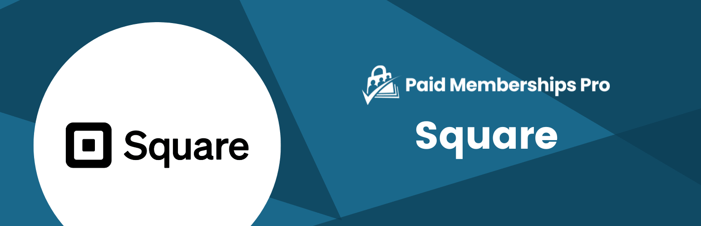

# [Paid Memberships Pro - Square](https://paidmembershipspro.com/add-ons/square) #

 

### Welcome to the Paid Memberships Pro - Square GitHub Repository
Adds the ability to accept one-time payments using the Square Payment Gateway.

**Note:** This Add On only supports one-time payments. Recurring subscriptions are not supported, and checkouts for membership levels or discount codes configured with recurring billing will be blocked. To accept recurring payments, use a gateway that supports subscriptions, such as Stripe.

For more information please visit [paidmembershipspro.com/add-ons/square](https://paidmembershipspro.com/add-ons/square)

## Installation ##
For detailed installation steps, visit the [documentation](https://paidmembershipspro.com/add-ons/square) page.

1. Download the current development ZIP file directly: `https://github.com/strangerstudios/pmpro-square/archive/dev.zip`

**Please ensure that once installing this version of the plugin to remove `-dev` from the plugin's folder name.**

## Bugs ##
If you find an issue/bug, let us know by [creating a detailed GitHub issue](https://github.com/strangerstudios/pmpro-square/issues/new).

## Support ##
This is a developer's portal for Paid Memberships Pro - Square. We do not offer support on this channel. **Any support related questions should be directed to [paidmembershipspro.com/add-ons/square](https://paidmembershipspro.com/add-ons/square).**

## Contributing to Paid Memberships Pro - Square ##
We encourage and welcome any contribution to Paid Memberships Pro - Square. Please read the [guidelines for contributing](https://github.com/strangerstudios/pmpro-square/blob/dev/.github/CONTRIBUTING.md) to this repository.

There are various **ways to the help development** of Paid Memberships Pro - Square:

1. Report [bugs/issues](https://github.com/strangerstudios/pmpro-square/issues/new) on GitHub.
2. Work on any issues by submitting a Pull Request.

Here are some ways for **non-developers to contribute** to Paid Memberships Pro - Square:

1. Translate Paid Memberships Pro - Square into your own [language](https://www.paidmembershipspro.com/paid-memberships-pro-in-your-language/).
2. [Purchase a paid membership](https://paidmembershipspro.com/pricing) to help fund ongoing development and bug fixes.
3. Leave an honest review for [Paid Memberships Pro - Square](https://www.paidmembershipspro.com/submit-testimonial/).